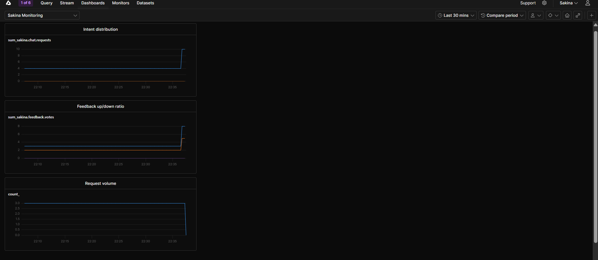

# Sakina

> A multilingual, emotion-aware mental-health support chatbot with retrieval-augmented
> generation, a crisis-safety gate, and an avatar that adapts to how you feel.


**ITI — AI Track · NLP Final Project · Intake 46**

---

## What it does

You send a message in any of **20 languages**. Sakina detects the language, reads the
emotion behind it, figures out what you're asking for, and — if it's a real mental-health
question — answers from a grounded counseling knowledge base. The reply streams back in
your language while the on-screen avatar shifts its expression to match your mood. If the
message signals self-harm risk, a crisis safety gate intervenes **before** anything else
and shows support resources.

## Features

- **Multilingual** — detects and replies across 20 languages (Arabic + English are the primary UI languages, with full RTL/LTR support).
- **Emotion-aware** — classifies six emotions (`sadness · joy · love · anger · fear · surprise`); the avatar's color and expression adapt in real time.
- **RAG-grounded answers** — hybrid retrieval (BM25 + dense `bge-m3`, RRF fusion, cross-encoder rerank) over a mental-health counseling corpus in Qdrant.
- **Smart routing** — five intents; only genuine mental-health questions go through retrieval, everything else is answered directly.
- **Crisis safety** — a fast regex gate runs before any model call and surfaces crisis hotline resources when self-harm risk is detected.
- **Voice** — speech-to-text and text-to-speech for hands-free conversation.
- **Conversation memory** — Redis-backed sessions (with a graceful in-process fallback) so Sakina remembers the thread.
- **Adaptive presence** — an emotion-reactive avatar plus a gentle idle check-in when you go quiet.

## How it works

```
your message
  1. Language detection  →  1 of 20 languages   (TF-IDF + calibrated LinearSVC)
  2. Emotion classifier  →  6 emotions           (translate-then-classify, no training)
  3. Intent classifier   →  5 intents            (few-shot LLM)
  4. RAG retrieval       →  grounded passages     (BM25 + bge-m3 + reranker, Qdrant)
  5. Orchestrator        →  empathetic, grounded reply (streamed)
  * Crisis gate          →  fires before everything → hotline card
```

## Tech stack

**Backend:** Python 3.11, FastAPI (SSE streaming), Transformers, sentence-transformers,
scikit-learn, Qdrant, Redis, Lightning AI (`gpt-oss-120b`). **Frontend:** React 18,
TypeScript, Vite, Tailwind, Vercel AI SDK. **Tooling:** `uv` workspace, `ruff`, `pytest`, `vitest`.

## Model Comparison

Each pipeline stage was chosen by benchmarking candidates on held-out data. The selected model is in **bold**.

**Language detection** — three classifiers on shared TF-IDF `char_wb` n-gram features (20 languages):

| Model | Test accuracy | Macro-F1 | Weakest language (`sw`) |
|---|---|---|---|
| Logistic Regression | 0.9953 | 0.9953 | 0.9661 |
| Naive Bayes | 0.9950 | 0.9950 | 0.9680 |
| **Calibrated LinearSVC** ✅ | **0.9959** | **0.9959** | **0.9708** |

> LinearSVC wins on every metric; `CalibratedClassifierCV` also exposes `predict_proba` for the lingua fallback.

**Emotion** — same DistilBERT classifier, varying the translation method (pooled macro-F1 across 20 languages, n=1200):

| Method | Pooled macro-F1 |
|---|---|
| **NLLB-200-distilled-1.3B** ✅ | **0.8975** |
| NLLB-200-distilled-600M | 0.8806 |
| LLM `gpt-oss-120b` (translate) | 0.8759 |
| LLM `gpt-oss-20b` (translate) | 0.7983 |
| LLM `gpt-oss-20b` (direct, no translation) | 0.4919 |

> NLLB-1.3B wins pooled (+1.7pp over 600M, better in 13/20 languages), is free/local, and costs 0 API calls. English-only test: accuracy 0.927, macro-F1 0.882.

## Installation

**Prerequisites:** Python 3.11, [`uv`](https://docs.astral.sh/uv/), Node 18+, and accounts for
[Qdrant Cloud](https://cloud.qdrant.io) + [Lightning AI](https://lightning.ai) (Redis and a
[Groq](https://console.groq.com) key are optional — for persistent memory and voice).

```bash
# clone
git clone https://github.com/OmarGamal488/sakina.git
cd sakina

# backend + notebooks (one venv for the whole workspace)
uv sync --all-packages --all-extras
cp api/.env.example api/.env        # fill in LIGHTNING_*, QDRANT_* (+ optional REDIS_URL, GROQ_API_KEY)

# frontend
cd frontend
npm install
cp .env.example .env.local          # VITE_API_URL=http://localhost:8001
cd ..
```

## Usage

Run the API and the frontend in two terminals:

```bash
# terminal 1 — API on http://localhost:8001
cd api
uv run uvicorn app.main:app --reload --port 8001

# terminal 2 — UI on http://localhost:5173
cd frontend
npm run dev
```

Open **http://localhost:5173** and start chatting.

**Rebuild the model artifacts** (optional — the four module notebooks):

```bash
uv run jupyter lab     # open notebooks/01..04 and Run All
```

**Browse the design demo** (no build step):

```bash
cd demo && python3 -m http.server 8000   # http://localhost:8000
```

## Deployment

The backend API is deployed on **Hugging Face Spaces** (Docker runtime, HTTPS enabled):

**Live API → https://HamzaHendy-sakina-api.hf.space**

- Health check: [`/health`](https://HamzaHendy-sakina-api.hf.space/health)
- Interactive docs: [`/docs`](https://HamzaHendy-sakina-api.hf.space/docs)

The frontend ([forked from `ishraq-hassan/chatbot-frontend`](https://github.com/ishraq-hassan/chatbot-frontend)) is deployed on GitHub Pages and points at the API above:

**Live frontend → https://hamza-hesham-hendy.github.io/chatbot-frontend/**

The Docker image is also published to the GitHub Container Registry at `ghcr.io/omargamal488/sakina`.

## CI/CD

A GitHub Actions workflow ([`.github/workflows/ci.yml`](.github/workflows/ci.yml)) runs on every push to the **`mlops-final`** branch. (This repository hosts the original NLP project on `main` and the MLOps deliverable on `mlops-final`, so CI is scoped to the latter to avoid running against the NLP codebase.) The pipeline runs four sequential jobs:

1. **Lint** — `ruff check` + `ruff format --check`
2. **Test** — the full `pytest` suite (must pass)
3. **Build & Push** — builds the Docker image and pushes it to GHCR
4. **Deploy** — pushes the app to the Hugging Face Space (only runs if lint + tests pass)

All actions are official/verified and pinned to stable versions.

## Monitoring Metrics

The API is instrumented with [OpenTelemetry](https://opentelemetry.io/) and exports metrics via OTLP to an OTel Collector, which forwards them to [Axiom](https://axiom.co/). Five instruments cover the three required categories:

**Model / NLP**

| Metric | Type | Why |
|---|---|---|
| `sakina.chat.requests` | Counter (by intent) | Tracks intent distribution — shows which intents are most common and flags model drift if the distribution shifts unexpectedly |
| `sakina.chat.latency` | Histogram (ms) | End-to-end response latency — catches slowdowns in RAG retrieval or LLM generation before users notice |

**Data**

| Metric | Type | Why |
|---|---|---|
| `sakina.message.length` | Histogram (chars) | Input size distribution — very short messages may signal bot traffic; very long ones may expose edge cases in the pipeline |
| `sakina.feedback.votes` | Counter (up / down) | Helpfulness ratio — direct user signal on response quality over time |

**Server**

| Metric | Type | Why |
|---|---|---|
| `sakina.http.errors` | Counter (by status code) | Error rate and reliability — 4xx/5xx spikes indicate broken clients or backend failures |

## System Monitoring

Metrics flow: **Sakina API → OTLP/gRPC (port 4317) → OTel Collector → Axiom**.

Run the full observability stack locally:

```bash
# copy api/.env.example → api/.env and fill in AXIOM_TOKEN + AXIOM_DATASET
docker compose up --build
```

Send traffic to `http://localhost:8000/chat` and watch metrics appear in your Axiom dataset.



## Team

ITI AI Track · NLP · Intake 46

- Abdullah Mohamed
- Ahmed Gamal
- Hamza Hesham
- Omar Gamal

## License

MIT — see [`LICENSE`](LICENSE).

Avatar artwork uses DiceBear's `micah` style by Micah Lanier, licensed
[CC BY 4.0](https://creativecommons.org/licenses/by/4.0/).
